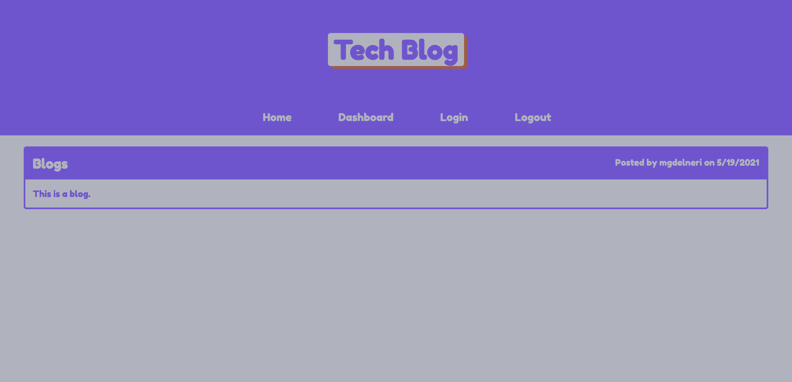

# Tech-Blog

## GOAL

The goal of this project was to create a CMS-style tech blog from scratch. The blog allows developers to create new posts, comment on other people's posts, and edit or delete their previous posts. The app was to incorporate the MVC paradigm, Handlebars.js, Sequelize as the ORM, and the express-session package for authentication. 

## PROCESS

As usual, my first step in tackling a project is to study the instructions carefully, taking notes along the way. Since this assignment involved coding both the front- and back-end from scratch, it was incredibly long and intimidating, so it took me a few days to understand how and where to start. To better organize myself, I referenced class activities and my own study notes, and set up the repo in GitHub and in VS Code, with all of the folders and files that I thought would be required. I then tried mapping out on paper the connection between all of the MVC elements, trying to visualize how each section would depend on the other. 

The first coding I did was in the config and controllers folders, as these seem to include more standard files and code that I could reuse from past activities. From there, I pretty much worked my way down the list through each folder. 

Once the app was able to be tested in the browser, there was a lot of tweeking and testing that needed to be done. 

Here is an image of the deployed Tech-Blog app:

## USAGE

The Tech-Blog app is deployed in Heroku under the [Tech-Blog Heroku link]().

The user can also access the app by using the Node.js command "npm start" in the Terminal of the Tech-Blog repo in VS Code. This will start the router in localhost:3001 in the user's browser. 

## CONCLUSION

This assignment was by far the most challenging so far. Even though I have a grasp on the theory behind it all, it was very hard for me to wrap my mind around the order in which I should work on the code itself. The amount of files and their interconnectedness made it incredibly inimidating. 

I could not have gotten through it all if it was not for references in the activities and also the help of class-mates and my tutor. This emphasized how important it is to collaborate on coding projects, especially as they get increasingly more complex. 

As with all apps, there is always room for improvement, but for the purposes of this assignment, the Tech-Blog app should fulfill the requirements. I did find a glitch in which the navigation links in the dashboard page did not center on the page like they do in the home page, but the functionality is still there, so I left it as is for now. 

Overall, this assignment seemed like a big challenge in not just the material we have been learning, but also for personal patience and perseverance when it comes to the world of coding. Although difficult and at times incredibly frustrating, I take this as a learning experience and something that all of us coders should get used to and learn to move past. 
